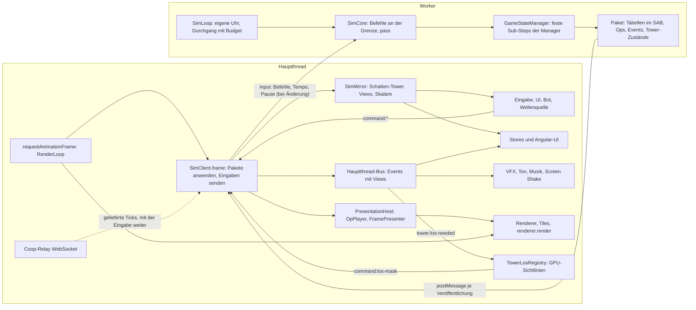
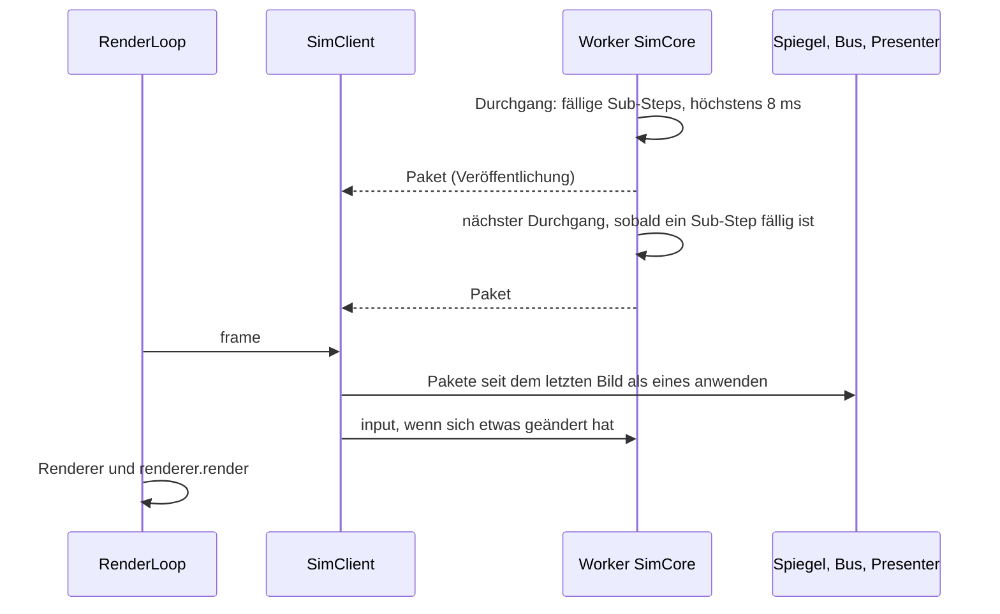

# Simulation im Worker (Umbau, Branch `simu-worker`)

Stand 2026-09-29 spät: Die Simulation läuft im Worker, alle Phasen sind umgesetzt, zwei Reviews (11 und 17 Befunde) sind
behoben. Specs, Lint und Build sind grün, die E2E-Suite läuft auf dem Worker-Stand, auch auf echten Tiles. Gemessen
bis 25 000 Gegner (siehe Kennzahlen und Mehr Gegner). Offene Prüfungen (Handtest, Bot-Lauf, Desktop-App, Header der
Webseite) stehen in TODO E71, die nächsten Hebel in E72, der Benchmark im Spiel in E74. Die Simulation läuft in einem Web Worker, der Hauptthread hält nur Bild, Ton,
UI, Eingabe, Tiles und die GPU-Sichtlinien. Grundlage: [WORKER_PLAN.md](WORKER_PLAN.md) (Stufe 1: echte Simulation im
Worker bitgleich).

## Überblick





Der Worker loopt mit eigener Uhr (`sim/worker/sim-loop.ts`, [SIM_DECOUPLE_PLAN.md](SIM_DECOUPLE_PLAN.md)): ein
Durchgang rechnet die fälligen Sub-Steps, höchstens 8 ms Wanduhr, veröffentlicht ein Paket, wenn der Hauptthread das
letzte bekommen hat (Abruf im Kontrollwort je Bild, sonst spätestens nach 100 ms), und gibt den Thread frei;
ohne fällige Arbeit schläft er bis zum nächsten fälligen Sub-Step oder bis eine Nachricht kommt (Pause, keine Welt).
Er wartet auf kein Bild. Jedes Bild beginnt mit `requestAnimationFrame` in der `RenderLoop`;
`GameLoopFacadeService` ruft darin `SimClient.frame`. Der wendet die Pakete, die seit dem letzten Bild aus dem Worker
kamen, als eines an (`merge-packets.ts`) und schickt Befehle, Tempo, Pause und Replay-Steuerung, wenn sich etwas
geändert hat. Beim Anwenden geht der Zustand in den Spiegel, die Ops an
den Presenter, die Events auf den Hauptthread-Bus und die Tabellen an die Renderer; UI, Ton, Bot und Wellenquelle
lesen nur Spiegel und Bus und antworten mit `command:*`. Nebenwege: Die Welt geht beim Laden einmal als `SimWorld` in
den Worker, im Coop reicht der Hauptthread die Ticks des Relays durch, das Replay ist ein Modus des Workers.

## Grundsätze

- **Ein Weg.** Der Hauptthread greift nie auf Sim-Objekte zu (kein `GameStateManager`, keine Manager, keine lebenden
  `Enemy`/`Projectile`). Er liest den Spiegel (`SimClient.mirror`), hört den Hauptthread-Bus (`SimClient.bus`, Events
  mit Views) und gibt Befehle (`command:*`). Die Simulation (`SimCore`) läuft im Worker; im selben Thread nur für
  Specs, über dieselbe Schnittstelle (`SimCoreApi`, `sim/protocol/messages.ts`).
- **Die Simulation kennt weder Engine noch Angular-UI.** Keine `ThreeTilesEngine`, keine Stores, keine Renderer.
  Darstellung geht als Op (`SimSink`, aufgezeichnet, `sim/protocol/ops.ts`), als Event oder als Tabelle im Paket.
- **Ein Paket je Veröffentlichung** (`sim/protocol/packet.ts`), auf dem Hauptthread je Bild zu einem gefaltet: Tabellen (Gegner, Geschosse, Tower, Oozes, Wurmketten),
  Skalare, geänderte Tower-Zustände, Ops, Events. Der Hauptthread wendet es an: Tower-Zustände, Gegner-Tabelle,
  Ops, dann Events, dann die Tabellen an die Renderer.
- **Keine parallelen Systeme.** Alter Pfad fällt mit dem neuen.

## Datenfluss

```
Hauptthread                                   Worker
UI/Eingabe --command:*--> SimClient.bus -----> input{commands} -> SimCore (GameStateManager ...)
Renderer/Ton <-- Presenter/OpPlayer <-- Paket <-- frame        <-- Pakete (Tabellen, Ops, Events) aus dem Loop
Stores/UI    <-- GameStateSync etc.  <-- SimClient.bus (Views)
LOS (GPU)    <-- tower:los-needed    --> command:los-mask --> SimCore
```

- Befehle gehen mit der Eingabe des Bilds (`SimClient.flushInput`) und wirken im Worker sofort, zwischen zwei
  Durchgängen, also an einer Grenze zwischen zwei Sub-Steps. Vor jedem Aufruf (`rpc`) geht die Eingabe voraus.
- Pakete auf Abruf: Der Hauptthread ruft am Anfang jedes Bilds das nächste Paket ab, wenn das letzte gekommen ist
  (Feld im Kontrollwort und eine kleine Nachricht, die einen schlafenden Loop weckt). Der Worker schreibt die Tabellen
  nur dann; ohne Abruf nur nach einer Eingabe, einem Aufruf, vor unbefristetem Schlaf oder nach 100 ms. Hängt er
  hinterher, antwortet er frühestens 33 ms nach dem letzten Paket.
- Gegendruck: Ruft der Hauptthread 250 ms lang nichts ab (versteckter Tab, langer Hänger), rechnet der Worker nicht
  weiter, bis der nächste Abruf kommt, und holt die Standzeit nicht nach. Das Spiel steht im versteckten Tab.
- Was der Hauptthread in einer Aufgabe schickt, geht als eine Nachricht und wirkt an derselben Grenze (etwa `reset`,
  Spieler und Lockstep beim Coop-Start).

## Verträge

| Datei | Inhalt |
|---|---|
| `sim/protocol/packet.ts` | Paket, Tabellen-Layout (Spalten `E_*`, `P_*`, `T_*`, `O_*`, `W_*`), Skalare, `TowerStateDto` |
| `sim/protocol/ops.ts` | Op = `[Pfad, ...Argumente]`, Rekorder; Argumente nur plain, Vektor als `{x,y,z}` |
| `sim/protocol/events.ts` | Events über die Grenze: Entities als Referenzen (`$e`, `$t`, `$p`, `$w`) mit den Zahlen des Moments |
| `sim/protocol/messages.ts` | `SimCoreApi` (configure, loadWorld, input, pass, idleMs, rpc), `SimInput`, `SimWorld`, Worker-Nachrichten |
| `sim/client/views.ts` | `EnemyView`, `ProjectileView`, `WormGroupView` mit den Feldpfaden der Entities |
| `sim/client/view-events.ts` | `ViewEvent = ToView<GameEvent>`, `MainEventBus` |

Tower auf dem Hauptthread sind **Schatten-Tower**: echte `Tower`-Objekte aus `TowerStateDto`, nie simuliert, ohne
den Id-Zähler anzufassen. `Tower.aim` wird je Bild aus der Tower-Tabelle gesetzt (der Tower-Renderer liest es).

## Entscheidungen

- **Sichtlinien:** Die Simulation wartet immer auf eine Maske (heute die Rolle des Coop-Gasts). Sie meldet
  `tower:los-needed`; der Hauptthread rendert auf der GPU und schickt `command:los-mask` (Einzelspieler und Coop-Host;
  Coop-Gäste rendern nicht). Die Maske steht im Befehlslog, das Replay braucht keine GPU. Folge: ein Tower bekommt
  seine Sicht ein bis zwei Bilder nach dem Bau.
- **Welt:** Der Hauptthread baut die Welt wie heute (Korridor, Tiles), friert sie ein und schickt `SimWorld`
  (Routen, Zellhöhen, Ursprung, HQ, Spawns, Boden unter den Spawns). Die Simulation baut ihr Raster daraus ohne Tiles;
  ihr Weltschlüssel muss dem des Hauptthreads gleichen. Der Hauptthread behält sein Raster für Sichtlinien, Anzeige
  und Boden der Renderer.
- **Wellenquelle, Bot:** bleiben auf dem Hauptthread und lesen den Spiegel. Die Wellenquelle zieht ihren Zufall aus
  einem eigenen `GameRng` mit dem Lauf-Seed (Strom `director`, dieselbe Folge wie bisher), der Bot ebenso (`bot`).
  Die Regeln der Wellenquelle gehen per `configure({waveSource})` in den Worker. Der Bot entscheidet je Bild statt je
  Sub-Step; seine Befehle gehen mit der nächsten Eingabe.
- **Stand, den die Wellenquelle liest:** Was sie bei `wave:completed` festhält (`StateSnapshotService`, etwa die
  Spielzeit) und was sie beim Planen der nächsten Welle liest, kommt aus dem Spiegel, also vom Ende des Pakets, mit
  dem das Event ankommt, nicht vom Sub-Step, in dem die Welle endete. Laufen mehrere Sub-Steps je Bild (hohes Tempo),
  kann dazwischen schon mehr geschehen sein. Bewusst so gelassen.
- **Auswahl eines Towers** ist UI-Zustand des Hauptthreads, nicht mehr der Simulation.
- **Coop:** Die Relay-Verbindung bleibt im Hauptthread; der Worker bekommt einen `LockstepLink`, der die gelieferten
  Ticks mit einer Eingabe erhält, sobald sie ankommen (nicht erst mit dem nächsten Bild), und Befehle, Hashes, Glätte
  zurückschickt. An der Barriere schläft der Loop bis zur nächsten Nachricht.
- **Replay:** läuft im Worker (RPC `replayEnter/Step/Seek/Exit`), Bilder kommen als normale Pakete.
- **Entwicklerwerkzeuge**, die heute Sim-Objekte ändern (Gegner anhalten, Tempo, Bewegung aus), werden `debug:*`-Befehle.

## Aufteilung

| Bereich | Wer | Dateien |
|---|---|---|
| Simulation frei von Engine und UI, `SimCore`, Worker-Einstieg | Agent `sim` | `managers/**`, `entities/**`, `game-components/**`, `services/combat/**`, Sim-Teil von `global-route-grid`, `simulator/**`, `sim/core/**`, `sim/worker/**` |
| Darstellung auf dem Hauptthread: OpPlayer, Presenter der Tabellen, Status-Looks, Gegner-/Ooze-/Wurm-Ton, Dienste (VFX, Audio, GameSounds, ScreenShake, Musik, Blutmond, HQ-Feuer) | Agent `pres` | `presentation/**` (neu), `game-engine/**` (Darstellung), `three-engine/**` (Anpassungen) |
| Spiegel und alle Leser auf dem Hauptthread | Agent `mirror` | `sim/client/mirror/**`, `components/**`, `services/**` (außer combat, LOS, Welt-Übergabe), `run-log/**`, `director/**`, `bots/**`, `store/**`, `tower-defense.component.*` |
| `SimClient`, Transporte, Event-Import, LOS-Dienst, Welt-Übergabe, Game-Loop, Coop, Replay, Integration | Lead | `sim/client/sim-client*.ts`, `sim/client/transport/**`, `services/tower-los-registry.ts`, LOS-Teil von `tower-placement`, `services/facade/*` (Verdrahtung), `services/coop.service.ts`, `services/replay.service.ts` |

## Phasen

1. Verträge (erledigt), dann parallel: `sim`, `pres`, `mirror`, Lead (Client, Transporte, LOS, Welt).
2. Zusammenführen, grün machen: Build, Specs, Spiel im Browser (E2E), Einzelspieler.
3. Worker-Transport scharf, Coop, Replay, Bots.
4. Messen gegen E57 (5000 Gegner, Tempo 4), E2E, Doku (ARCHITECTURE, EVENT_SYSTEM, WORKER_PLAN).

## Transport

- **Tabellen** (Gegner, Geschosse, Tower, Oozes, Würmer) im `SharedArrayBuffer` (`sim/protocol/table-store.ts`,
  `wire.ts`): der Worker schreibt, der Hauptthread liest ohne Kopie. Drei Sätze Tabellen: einen schreibt der Worker,
  einer hält das neueste Paket, einen liest der Hauptthread; ein Kontrollwort im SAB (`Atomics`) sagt, welcher Satz
  welches Paket hält, und der Worker schreibt nie den Satz, den der Hauptthread liest (`TableViews.claim`). Wächst eine
  Tabelle, geht der neue Puffer einmal mit. Ohne `crossOriginIsolated` ein Satz, und jede Veröffentlichung trägt Kopien
  ihrer Zeilen. Die Spieluhr hält höchstens 250 ms Wanduhr Rückstand (`GameClock.MAX_BACKLOG_MS`); bis 2026-09-30 holte
  sie je Tick höchstens 50 ms nach, und ein Tick ging erst mit dem nächsten Bild los (ab 35 ms Tick-Zeit früher), was
  bei langsamen Bildern zur Zeitlupe wurde.
- **Spiegel** (`sim/client/mirror/sim-mirror.ts`): kopiert je Paket die Gegnertabelle einmal (zwei Kopien im Wechsel)
  und zeigt jede `EnemyView` auf ihre Zeile; die Felder lesen die Zeile erst beim Zugriff. Eine Ansicht, deren Gegner
  die Tabelle verlässt oder deren Werte ein Event auf seinen Moment setzt, bekommt eine eigene Zeile.
- **Variables** (Befehle, Events, Ops, Tower-Zustände, RPC) per `postMessage`; es ist zugleich das Wecksignal.
  `Atomics.wait`/`notify` bräuchten wir nur für ein reines Shared-Memory-Signal; der Worker dürfte dann blockierend
  warten, der Hauptthread liest einmal je Bild (Firefox hat kein `Atomics.waitAsync`).
- **Header** für die Isolation: Web `public/.htaccess` (COOP same-origin, COEP credentialless), Dev-Server in
  `angular.json`, Desktop-App im `app://`-Handler. Nach dem nächsten Deploy mit `curl -I` prüfen.

## Kennzahlen

Zwei Zahlen statt einer: die **Bildzeit** des Hauptthreads (FPS) und die **Rechenzeit** der Simulation im Worker
(`SimScalars.tickMs` je Paket, zerlegt per RPC `tickProfile`; über die Pakete summiert und durch die Wanduhr geteilt
die Auslastung des Workers); dazu kostet das Anwenden der Pakete eines Bilds den Hauptthread `SimClient.applyTimes`.

Wo sie im Spiel stehen (TODO E82, E75, E74):

- **FPS-Anzeige** (oben links, drei Stufen): ab Stufe 2 Tempo erreicht / eingestellt und Worker-Last, ab Stufe 3 Ticks
  je Sekunde, Speicher-Modus, Kosten je Paket, Gegner und Mini-Charts. Alles aus `PacketSums`
  (`sim/client/load-stats.ts`): Tick-Zeit, Sub-Steps, Spielzeit und Einräumzeiten, die jedes Paket ohnehin bringt;
  keine zusätzliche Zeitmessung, zugeklappt hört sie nicht einmal auf die Pakete.
- **Performance-Fenster** (Dev-Menü): Simulation je Teil im Worker (Befehle, Gegner mit Bewegung/Raster/Höhe als
  Stichprobe, Kampf, Geschosse, Events, Rest, Paket schreiben), Einräumen je Teil, Spielschleife und Zeichnen des
  Hauptthreads (nur CPU). Nur solange es offen ist: `SimConfig.profile` setzt dann den Profiler im Worker
  (`sim/core/sim-profile.ts`), das Fenster holt die Summen alle 0,5 s per RPC `profileSums`; `RenderLoop.setTiming`
  misst das Bild. Geschlossen nimmt ein Tick nur die Zeitstempel, die er schon vorher nahm (vier für `tickMs`, zwei je
  Befehl).
- **Benchmark** (Spielmenü): lädt die Seite in die DevWorld neu (`?devworld&bot=manual&benchmark`, auch von einer
  echten Karte aus, ohne Tiles und Kartensitzung), baut die Szene des Lastlaufs (`benchmark/load-scene.ts`, dieselbe
  wie `e2e/perf/sim-load.ts`: 40 Tower, Gegner mit 1 000 000 HP und 0,5 m/s auf den ersten 70 % der Routen,
  Auffüllen mit Warten auf die Simulation, Einpendeln) und misst 2000, 5000 und 10 000 Gegner je bei Tempo 4 und 1, je 8 s. Am Ende eine
  Tabelle und ein Knopf, der sie als Text kopiert; jede Zeile trägt Version, Commit, Browser, System, Threads,
  Speicher, GPU, Pixeldichte und Fenster. Das CPU-Modell kann der Browser nicht lesen, der Text sagt das.

### Messrechner

Alle Zahlen dieses Dokuments stammen von Rechner **A**. Messungen weiterer Rechner kommen mit eigenem Namen dazu
(`sim-load.ts --machine <Name>`); jedes Ergebnis nennt seit 2026-09-29 selbst CPU, Threads, Speicher, Betriebssystem,
Browser, GPU (so wie WebGL sie meldet) und Pixeldichte.

| Rechner | CPU | RAM | GPU | Monitor | Betriebssystem | Browser |
|---|---|---|---|---|---|---|
| A | AMD Ryzen 9 9950X3D, 16 Kerne / 32 Threads, Basistakt 4,3 GHz, 128 MB L3 | 64 GB DDR5-4800 | NVIDIA GeForce RTX 5080 | 2560 × 1440, 144 Hz, Windows-Skalierung 125 % | Windows 11 Pro 64 Bit, 10.0.26200 | Chromium 141.0.7390.37, Firefox 142.0.1 (Playwright 1.56.1) |

Firefox meldet die GPU absichtlich vergröbert („GTX 980 or similar“, Schutz vor Fingerprinting) und hat in den sichtbaren
Läufen die Windows-Skalierung übernommen: Pixeldichte 1,25 gegen 1,0 in Chromium, also rund 56 % mehr Pixel je Bild.
Vergleiche innerhalb eines Browsers betrifft das nicht; Chromium gegen Firefox ist deshalb kein fairer Vergleich. Künftige
Läufe setzen die Pixeldichte mit `--dpr 1` fest.

Messung 2026-09-29 spät (`e2e/perf/sim-load.ts`, Produktions-Build, DevWorld, 40 Tower, 5000 Gegner mit 1 000 000 HP,
Tempo 4, sichtbare Fenster, eingependelt; Chromium ohne Bildratenbremse drei Läufe, Firefox auf 144-Hz-Monitor zwei,
Mittelwerte). „Fix“ ist die gebackene Vorschau der Seitenleiste (E73), auf `next` nur für die Messung eingespielt:

| | `next` | `next` + Fix | Worker | Worker + Fix |
|---|---|---|---|---|
| Chromium FPS / langsamste 5 % | 235 / 154 | 290 / 207 | 245 / 187 | 245 / 200 |
| Firefox FPS / langsamste 5 % | 21 / 18 | 44 / 20 | 68 / 33 | 91 / 33 |
| Worker ausgelastet (Chromium / Firefox) | – | – | 37 / 28 % | 37 / 34 % |

- **Firefox:** der Worker verdoppelt die Bildrate (44 auf 91 bei gleichem Fix), die langsamsten Bilder auch (20 auf 33).
- **Chromium:** bei 5000 Gegnern ohne Gewinn, mit Fix sogar weniger Bilder als `next` (245 gegen 290): das Anwenden des
  Pakets kostet den Hauptthread etwa so viel wie vorher die Simulation. Der Gewinn kommt mit mehr Gegnern (siehe unten).

Korrektur: Die erste Messung am Nachmittag (Firefox 127 / 72) lief mit einem Stand, auf dem die Gegnergruppen der
Seitenleiste fehlten (Review-Befund, `wave:groups` ohne Hörer). Deren Vorschauen kosteten Firefox rund 6 ms je Bild
(Bisect auf `fe2d2c62`); seit E73 sind sie gebacken.

## Mehr Gegner (gemessen 2026-09-29)

Ziel: mehr Gegner gleichzeitig bei gleicher Bildrate. Kurve mit `e2e/perf/sim-load.ts --steps
3000,5000,8000,12000,16000,20000,25000 --speeds 4,1` (Produktions-Build, DevWorld, 40 Tower, Gegner mit 1 000 000 HP,
sichtbare Fenster auf einem 144-Hz-Monitor, vor jeder Messung eingependelt). `next` ohne, Worker mit Vorschau-Fix. FPS,
in Klammern das erreichte Tempo, wo es unter 3,9 fällt:

| Gegner (lebend, Tempo 4) | Chromium `next` | Chromium Worker | Firefox `next` | Firefox Worker |
|---|---|---|---|---|
| ~3000 | 144 | 144 | 44 | 98 |
| ~4900 | 142 | 144 | 21 | 84 |
| ~7300 | 98 | 144 | 13 (2,6) | 82 |
| ~11000 | 27 | 144 | 9 (1,8) | 77 (2,7) |
| ~14500 | 15 (3,0) | 129 | 6 (1,2) | 67 (2,4) |
| ~18500 | 10 (2,1) | 103 (3,1) | 4 (0,9) | 63 (1,9) |
| ~23500 | 8 (1,6) | 83 (2,3) | 3 (0,7) | 60 (1,4) |

Tempo 1: Chromium `next` 144 bis rund 7700, 101 bei 11000, 24 bei 24000; Worker 142 bei 11700, 102 bei 19000, 82 bei
24000. Firefox `next` 79 bei 3000, 8 bei 25000; Worker 105 bei 3000, 52 bei 24000.

- **Chromium** hält 144 FPS und Tempo 4 bis rund 11000 Gegner statt 4900; das Tempo hält bis rund 14000 statt 11000.
  Darüber ist der Worker zu 72 bis 77 % beschäftigt und bekommt nur 11 bis 25 Ticks je Sekunde.
- **Firefox** zeichnet in jeder Stufe 2- bis 20-mal so viele Bilder, hält Tempo 4 aber nur bis rund 7300 Gegner. Grenze
  ist der Hauptthread: ein Paket anzuwenden kostet 6 ms bei 7300 und 19 ms bei 24000 Gegnern; der Worker ist höchstens
  zu 71 % beschäftigt.
- **GPU je Gegner** (Chromium ohne Bremse, Tempo 1, Gegner ein- und ausgeblendet): 0,9 ms bei 8000, 3,2 ms bei 16000,
  6,8 ms bei 25000 Gegnern je Bild, rund 0,27 µs je Gegner. Damals gab es höchstens 20 000 Lebensbalken
  und 20 000 Instanzen je Gegnertyp; seit E77 wachsen beide Puffer mit der Zahl der Gegner (verdoppeln sich).
- In beiden Browsern bremst das Bild den Worker: ein Tick geht erst mit dem nächsten Bild los, während der Hauptthread
  ein langes Paket anwendet, wartet der Worker.

Hebel nach den Messwerten:

1. **Hauptthread verschlanken** (Firefox, und Chromium bei wenigen Gegnern): Spiegel und Presenter laufen je einmal über
   alle Gegner mit eigener Map (`sim-mirror.ts` applyEnemyTable, `frame-presenter.ts`); eine Schleife, Views nur bei
   Bedarf, Instanzpuffer direkt aus der Tabelle.
2. **Tick vom Bild lösen**: den nächsten Tick losschicken, sobald das Paket da ist, statt beim nächsten Bild (braucht
   zwei Tabellen-Puffer im SAB, weil der Hauptthread noch liest).
3. **GPU je Gegner**: Culling pro Instanz (die Gegner-Instanzen haben `frustumCulled = false`), einfacheres Modell in
   der Entfernung, Lebensbalken nur nahe der Kamera.
   Gemessen 2026-09-30: Culling im Vertex-Shader (Hüllkugel gegen das Sichtfeld) bringt in Chromium ohne
   Bildratenbremse bei 8000 bis 25 000 Gegnern nichts über die Streuung von rund ±10 FPS, auch nicht, wenn alle Gegner
   außerhalb des Bildes stehen; nicht übernommen.
4. **Worker schneller** (Chromium ab rund 14000): Gegnerfelder als typisierte Arrays im SAB, danach mehrere Worker
   phasenweise im Sub-Step.

## Hebel gebaut (gemessen 2026-09-30)

Messlauf wie oben, aber mit Pixeldichte 1 in beiden Browsern, Gegnern mit 0,5 m/s und genauem Auffüllen (TODO E78,
[E2E.md](E2E.md#lastmessung-e2eperfsim-loadts)); die Zahlen sind deshalb nicht direkt mit denen vom 2026-09-29
vergleichbar. `next` mit dem Vorschau-Fix, „vorher“ der Worker-Stand vom Vorabend (`147f7b60`), „jetzt“ mit Hebel 1 und
2, Panel, FPS-Anzeige und Benchmark (`43371665`). FPS, in Klammern das erreichte Tempo, wo es unter 97 % des
eingestellten fällt:

| Gegner, Tempo 4 | Chromium `next` | Chromium vorher | Chromium jetzt | Firefox `next` | Firefox vorher | Firefox jetzt |
|---|---|---|---|---|---|---|
| 5000 | 144 | 144 | 144 | 44 | 86 | 90 |
| 8000 | 142 | 144 | 144 | 13 (2,69) | 83 (3,85) | 87 |
| 12000 | 55 | 144 | 144 | 9 (1,74) | 79 (2,48) | 83 (3,46) |
| 16000 | 21 | 100 | 102 | 6 (1,30) | 69 (2,42) | 71 (3,34) |
| 20000 | 13 (2,56) | 86 | 88 | 5 (1,01) | 70 (1,88) | 67 (2,48) |
| 25000 | 9 (1,87) | 74 (3,34) | 72 | 4 (0,74) | 56 (1,40) | 60 (2,00) |

| Gegner, Tempo 1 | Chromium `next` | Chromium vorher | Chromium jetzt | Firefox `next` | Firefox vorher | Firefox jetzt |
|---|---|---|---|---|---|---|
| 8000 | 144 | 144 | 144 | 52 | 78 | 88 |
| 12000 | 143 | 144 | 144 | 20 (0,93) | 70 | 76 |
| 16000 | 95 | 82 | 90 | 15 (0,75) | 62 (0,95) | 73 |
| 20000 | 66 | 85 | 85 | 11 (0,54) | 64 (0,91) | 66 (0,93) |
| 25000 | 41 | 73 | 72 | 9 (0,47) | 49 (0,69) | 59 (0,82) |

Gebaut (Hebel 1 und 2 der Liste oben):

- **Tick vom Bild gelöst** (siehe Transport): Firefox erreicht bei Tempo 4 deutlich mehr Tempo bei etwa gleicher
  Bildrate (12000: 3,46 statt 2,48; 16000: 3,34 statt 2,42; 25000: 2,00 statt 1,40), der Worker ist dann zu 63 bis 94 %
  beschäftigt; Chromium erreicht bei 25000 Tempo 3,89 statt 3,34. Mehr Simulation heißt mehr Pakete je Sekunde: in
  einem Zwischenlauf nur mit Hebel 1 und 2 zeichnete Firefox bei 16000 und 20000 Gegnern 61 bis 62 statt 69 bis 70
  Bilder, im Schlusslauf 67 bis 71; die Läufe streuen um einige FPS.
- **Spiegel liest bei Bedarf** statt 17 Zahlen je Gegner und Paket zu schreiben: in Firefox bei 16000 Gegnern 1,1 bis
  1,4 ms statt 4,4 ms je Paket.
- **Presenter:** keine Map-Schreibzugriffe und keine Routensuche je Gegner mehr, Statusoptik nur für Gegner mit Effekt.
- **Nicht gebaut, weil ohne Gewinn gemessen:** Gegnergeräusche ausgelassen (Presenter 4,30 statt 4,32 ms bei 16000 in
  Firefox), Typindex im Paketschreiber (unter 1 % der Worker-Zeit).

**Entkopplung (gemessen 2026-09-30, [SIM_DECOUPLE_PLAN.md](SIM_DECOUPLE_PLAN.md)):** Der Worker loopt mit eigener
Uhr, der Hauptthread ruft je Bild ein Paket ab. Tempo 4, Messrechner A, der Lauf an eine Hälfte der Kerne gebunden,
zwei Runden deckungsgleich, vorher (`88658b44`) → nachher (`3867621a`); die Zahlen sind wegen der Bindung nicht mit
den Tabellen oben vergleichbar:

| | Tempo | Neue Stände je s | FPS |
|---|---|---|---|
| Firefox 16 000 | 3,9 → 4,0 | 24 → 43 bis 49 | 107 → 102 |
| Firefox 25 000 | 3,0 → 3,2 | 15 → 27 | 72 → 71 |
| Chromium 16 000 | 4,0 → 4,0 | 48 → 107 bis 111 | 128 → 112 |
| Chromium 25 000 | 3,97 → 4,0 | 23 → 62 | 85 → 75 |

„Neue Stände je s“ zählt die Bilder, die ein neues Paket anwenden; vorher wiederholten die meisten Bilder den alten
Stand.

Wo die Zeit jetzt hingeht (CPU-Profil `sim-load.ts --profile`, Chromium, 25000 Gegner, Tempo 4):

- **Hauptthread:** zu 39 % im Leerlauf bei 73 FPS, die Grenze ist in Chromium also das Zeichnen. Größte Posten:
  `presentEnemies` 106 ms/s, Spiegel 92 ms/s (vor dem Umbau des Spiegels), Animationen 56 ms/s, Instanzmatrizen 47 ms/s.
- **Worker** (zu 88 % beschäftigt): Bewegung der Gegner rund 43 % (`move`, `place`, `placeOnArc`, Winkelfunktionen),
  Gegner-Update mit Rastern und Höhe 19 %, Kampf rund 11 %, Paket schreiben 7 %.

**Mehrere Worker, Labor** (`tools/multi-worker`, `e2e/perf/multi-worker.mjs`, Branch `perf/multi-worker-lab`): der
Bewegungsteil des Sub-Steps mit den echten `Enemy`- und `MovementComponent`-Objekten, über 1 bis 4 Worker verteilt, per
`Atomics` im Takt. Ergebnis je Sub-Step:

| Gegner | Chromium 1 / 2 / 4 Worker | Firefox 1 / 2 / 4 Worker |
|---|---|---|
| 8000 | 0,45 / 0,24 / 0,14 ms (×3,3) | 0,56 / 0,30 / 0,16 ms (×3,5) |
| 16000 | 1,00 / 0,86 / 0,47 ms (×2,2) | 1,18 / 0,62 / 0,32 ms (×3,7) |
| 25000 | 1,51 / 1,35 / 0,88 ms (×1,7) | 2,26 / 1,30 / 0,66 ms (×3,4) |

Die Positionen sind bei jeder Worker-Zahl und in beiden Browsern bitgleich (dieselbe Prüfsumme). Chromium skaliert bei
vielen Gegnern schlecht (der Speicher bremst, siehe Profil). Da die Bewegung rund 43 % des Workers ausmacht, bringen
4 Worker hochgerechnet etwa das 1,3-fache (Chromium) bis 1,4-fache (Firefox) an Simulation, und das nur dort, wo der
Worker die Grenze ist: Firefox ab rund 12000, Chromium ab rund 25000 Gegnern bei Tempo 4. Für den Bau im Spiel müssen
die Bewegungsdaten den Worker verlassen können (Gegnerdaten im SAB oder Bewegungsobjekte in den Helfern), mit Snapshot,
Prüfsumme und Coop-Resync bitgleich; das berührt 24 Dateien und ist ein eigener Umbau (TODO E72).
