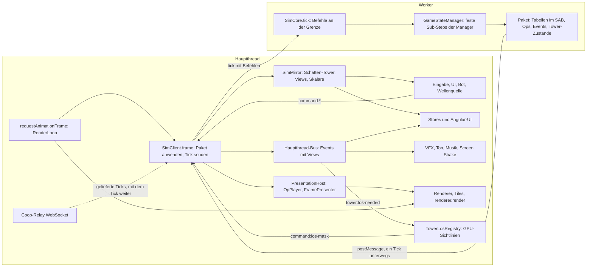
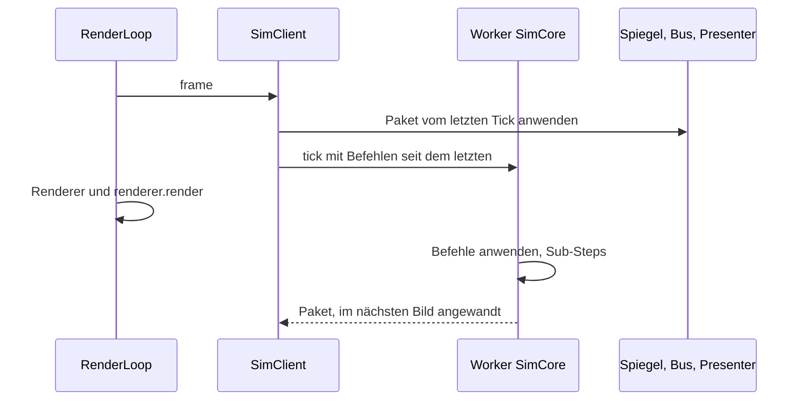

# Simulation im Worker (Umbau, Branch `simu-worker`)

Stand 2026-09-29 abends: Die Simulation läuft im Worker, alle Phasen sind umgesetzt. Specs, Lint und Build sind grün,
die E2E-Suite läuft auf dem Worker-Stand, auch auf echten Tiles. Offene Prüfungen (Handtest, Bot-Lauf, Desktop-App,
Header der Webseite) stehen in TODO E71. Die Simulation läuft in einem Web Worker, der Hauptthread hält nur Bild, Ton,
UI, Eingabe, Tiles und die GPU-Sichtlinien. Grundlage: [WORKER_PLAN.md](WORKER_PLAN.md) (Stufe 1: echte Simulation im
Worker bitgleich).

## Überblick





Jedes Bild beginnt mit `requestAnimationFrame` in der `RenderLoop`; `GameLoopFacadeService` ruft darin
`SimClient.frame`. Der wendet das Paket an, das seit dem letzten Bild aus dem Worker kam, und schickt den nächsten
Tick mit den Befehlen seit dem letzten, solange kein Tick unterwegs ist. Der Worker rechnet die Sub-Steps, während
der Hauptthread mit dem zuletzt angewandten Stand rendert. Beim Anwenden geht der Zustand in den Spiegel, die Ops an
den Presenter, die Events auf den Hauptthread-Bus und die Tabellen an die Renderer; UI, Ton, Bot und Wellenquelle
lesen nur Spiegel und Bus und antworten mit `command:*`. Nebenwege: Die Welt geht beim Laden einmal als `SimWorld` in
den Worker, im Coop reicht der Hauptthread die Ticks des Relays durch, das Replay ist ein Modus des Workers.

## Grundsätze

- **Ein Weg.** Der Hauptthread greift nie auf Sim-Objekte zu (kein `GameStateManager`, keine Manager, keine lebenden
  `Enemy`/`Projectile`). Er liest den Spiegel (`SimClient.mirror`), hört den Hauptthread-Bus (`SimClient.bus`, Events
  mit Views) und gibt Befehle (`command:*`). Die Simulation (`SimCore`) läuft im Worker; im selben Thread nur für
  Specs, über dieselbe Schnittstelle (`SimCoreApi`, `sim/protocol/messages.ts`).
- **Die Simulation kennt weder Engine noch Angular-UI.** Keine `ThreeTilesEngine`, keine Stores, keine Renderer.
  Darstellung geht als Op (`SimSink`, aufgezeichnet, `sim/protocol/ops.ts`), als Event oder als Tabelle im Paket.
- **Ein Paket je Bild** (`sim/protocol/packet.ts`): Tabellen (Gegner, Geschosse, Tower, Oozes, Wurmketten),
  Skalare, geänderte Tower-Zustände, Ops, Events. Der Hauptthread wendet es an: Tower-Zustände, Gegner-Tabelle,
  Ops, dann Events, dann die Tabellen an die Renderer.
- **Keine parallelen Systeme.** Alter Pfad fällt mit dem neuen.

## Datenfluss

```
Hauptthread                                   Worker
UI/Eingabe --command:*--> SimClient.bus -----> tick{commands} --> SimCore (GameStateManager ...)
Renderer/Ton <-- Presenter/OpPlayer <-- Paket <-- frame        <-- Paket (Tabellen, Ops, Events)
Stores/UI    <-- GameStateSync etc.  <-- SimClient.bus (Views)
LOS (GPU)    <-- tower:los-needed    --> command:los-mask --> SimCore
```

- Ein Tick ist unterwegs, dann erst der nächste (Gegendruck). Befehle zwischen zwei Ticks gehen mit dem nächsten.
- Befehle wirken an der Grenze vor dem ersten Sub-Step des Ticks (wie heute zwischen zwei Bildern).

## Verträge

| Datei | Inhalt |
|---|---|
| `sim/protocol/packet.ts` | Paket, Tabellen-Layout (Spalten `E_*`, `P_*`, `T_*`, `O_*`, `W_*`), Skalare, `TowerStateDto` |
| `sim/protocol/ops.ts` | Op = `[Pfad, ...Argumente]`, Rekorder; Argumente nur plain, Vektor als `{x,y,z}` |
| `sim/protocol/events.ts` | Events über die Grenze: Entities als Referenzen (`$e`, `$t`, `$p`, `$w`) mit den Zahlen des Moments |
| `sim/protocol/messages.ts` | `SimCoreApi` (configure, loadWorld, tick, rpc), `SimWorld`, Worker-Nachrichten |
| `sim/client/views.ts` | `EnemyView`, `ProjectileView`, `WormGroupView` mit den Feldpfaden der Entities |
| `sim/client/view-events.ts` | `ViewEvent = ToView<GameEvent>`, `MainEventBus` |

Tower auf dem Hauptthread sind **Schatten-Tower**: echte `Tower`-Objekte aus `TowerStateDto`, nie simuliert, ohne
den Id-Zähler anzufassen. `Tower.aim` wird je Bild aus der Tower-Tabelle gesetzt (der Tower-Renderer liest es).

## Entscheidungen

- **Sichtlinien:** Die Simulation wartet immer auf eine Maske (heute die Rolle des Coop-Gasts). Sie meldet
  `tower:los-needed`; der Hauptthread rendert auf der GPU und schickt `command:los-mask` (Einzelspieler und Coop-Host;
  Coop-Gäste rendern nicht). Die Maske steht im Befehlslog, das Replay braucht keine GPU. Folge: ein Tower bekommt
  seine Sicht ein bis zwei Bilder nach dem Bau.
- **Welt:** Der Hauptthread baut die Welt wie heute (Korridor, Tiles), friert sie ein und schickt `SimWorld`
  (Routen, Zellhöhen, Ursprung, HQ, Spawns, Boden unter den Spawns). Die Simulation baut ihr Raster daraus ohne Tiles;
  ihr Weltschlüssel muss dem des Hauptthreads gleichen. Der Hauptthread behält sein Raster für Sichtlinien, Anzeige
  und Boden der Renderer.
- **Wellenquelle, Bot:** bleiben auf dem Hauptthread und lesen den Spiegel. Die Wellenquelle zieht ihren Zufall aus
  einem eigenen `GameRng` mit dem Lauf-Seed (Strom `director`, dieselbe Folge wie bisher), der Bot ebenso (`bot`).
  Die Regeln der Wellenquelle gehen per `configure({waveSource})` in den Worker. Der Bot entscheidet je Bild statt je
  Sub-Step; seine Befehle wirken am nächsten Tick.
- **Stand, den die Wellenquelle liest:** Was sie bei `wave:completed` festhält (`StateSnapshotService`, etwa die
  Spielzeit) und was sie beim Planen der nächsten Welle liest, kommt aus dem Spiegel, also vom Ende des Pakets, mit
  dem das Event ankommt, nicht vom Sub-Step, in dem die Welle endete. Laufen mehrere Sub-Steps je Bild (hohes Tempo),
  kann dazwischen schon mehr geschehen sein. Bewusst so gelassen.
- **Auswahl eines Towers** ist UI-Zustand des Hauptthreads, nicht mehr der Simulation.
- **Coop:** Die Relay-Verbindung bleibt im Hauptthread; der Worker bekommt einen `LockstepLink`, der die gelieferten
  Ticks je Tick-Nachricht erhält und Befehle, Hashes, Glätte zurückschickt.
- **Replay:** läuft im Worker (RPC `replayEnter/Step/Seek/Exit`), Bilder kommen als normale Pakete.
- **Entwicklerwerkzeuge**, die heute Sim-Objekte ändern (Gegner anhalten, Tempo, Bewegung aus), werden `debug:*`-Befehle.

## Aufteilung

| Bereich | Wer | Dateien |
|---|---|---|
| Simulation frei von Engine und UI, `SimCore`, Worker-Einstieg | Agent `sim` | `managers/**`, `entities/**`, `game-components/**`, `services/combat/**`, Sim-Teil von `global-route-grid`, `simulator/**`, `sim/core/**`, `sim/worker/**` |
| Darstellung auf dem Hauptthread: OpPlayer, Presenter der Tabellen, Status-Looks, Gegner-/Ooze-/Wurm-Ton, Dienste (VFX, Audio, GameSounds, ScreenShake, Musik, Blutmond, HQ-Feuer) | Agent `pres` | `presentation/**` (neu), `game-engine/**` (Darstellung), `three-engine/**` (Anpassungen) |
| Spiegel und alle Leser auf dem Hauptthread | Agent `mirror` | `sim/client/mirror/**`, `components/**`, `services/**` (außer combat, LOS, Welt-Übergabe), `run-log/**`, `director/**`, `bots/**`, `store/**`, `tower-defense.component.*` |
| `SimClient`, Transporte, Event-Import, LOS-Dienst, Welt-Übergabe, Game-Loop, Coop, Replay, Integration | Lead | `sim/client/sim-client*.ts`, `sim/client/transport/**`, `services/tower-los-registry.ts`, LOS-Teil von `tower-placement`, `services/facade/*` (Verdrahtung), `services/coop.service.ts`, `services/replay.service.ts` |

## Phasen

1. Verträge (erledigt), dann parallel: `sim`, `pres`, `mirror`, Lead (Client, Transporte, LOS, Welt).
2. Zusammenführen, grün machen: Build, Specs, Spiel im Browser (E2E), Einzelspieler.
3. Worker-Transport scharf, Coop, Replay, Bots.
4. Messen gegen E57 (5000 Gegner, Tempo 4), E2E, Doku (ARCHITECTURE, EVENT_SYSTEM, WORKER_PLAN).

## Transport

- **Tabellen** (Gegner, Geschosse, Tower, Oozes, Würmer) im `SharedArrayBuffer` (`sim/protocol/table-store.ts`,
  `wire.ts`): der Worker schreibt, der Hauptthread liest ohne Kopie. Ein Tick ist unterwegs, also braucht der Speicher
  keine Sperre. Wächst eine Tabelle, geht der neue Puffer einmal mit. Ohne `crossOriginIsolated` dieselbe Form mit
  Kopien je Bild.
- **Variables** (Befehle, Events, Ops, Tower-Zustände, RPC) per `postMessage`; es ist zugleich das Wecksignal.
  `Atomics.wait`/`notify` bräuchten wir nur für ein reines Shared-Memory-Signal; der Worker dürfte dann blockierend
  warten, der Hauptthread liest einmal je Bild (Firefox hat kein `Atomics.waitAsync`).
- **Header** für die Isolation: Web `public/.htaccess` (COOP same-origin, COEP credentialless), Dev-Server in
  `angular.json`, Desktop-App im `app://`-Handler. Nach dem nächsten Deploy mit `curl -I` prüfen.

## Kennzahlen

Zwei Zahlen statt einer: die **Bildzeit** des Hauptthreads (FPS) und die **Tick-Zeit** der Simulation im Worker
(`SimScalars.tickMs`, zerlegt per RPC `tickProfile`); dazu kostet das Anwenden eines Pakets den Hauptthread
`SimClient.applyTimes`.

### Messrechner

Alle Zahlen dieses Dokuments stammen von Rechner **A**. Messungen weiterer Rechner kommen mit eigenem Namen dazu
(`sim-load.ts --machine <Name>`); jedes Ergebnis nennt seit 2026-09-29 selbst CPU, Threads, Speicher, Betriebssystem,
Browser, GPU (so wie WebGL sie meldet) und Pixeldichte.

| Rechner | CPU | RAM | GPU | Monitor | Betriebssystem | Browser |
|---|---|---|---|---|---|---|
| A | AMD Ryzen 9 9950X3D, 16 Kerne / 32 Threads | 64 GB DDR5-4800 | NVIDIA GeForce RTX 5080 | 2560 × 1440, 144 Hz, Windows-Skalierung 125 % | Windows 11 Pro 26200 | Chromium 141.0.7390.37, Firefox 142.0.1 (Playwright 1.56.1) |

Firefox meldet die GPU absichtlich vergröbert („GTX 980 or similar“, Schutz vor Fingerprinting) und hat in den sichtbaren
Läufen die Windows-Skalierung übernommen: Pixeldichte 1,25 gegen 1,0 in Chromium, also rund 56 % mehr Pixel je Bild.
Vergleiche innerhalb eines Browsers betrifft das nicht; Chromium gegen Firefox ist deshalb kein fairer Vergleich. Künftige
Läufe setzen die Pixeldichte mit `--dpr 1` fest.

Messung 2026-09-29 spät (`e2e/perf/sim-load.ts`, Produktions-Build, DevWorld, 40 Tower, 5000 Gegner mit 1 000 000 HP,
Tempo 4, sichtbare Fenster, eingependelt; Chromium ohne Bildratenbremse drei Läufe, Firefox auf 144-Hz-Monitor zwei,
Mittelwerte). „Fix“ ist die gebackene Vorschau der Seitenleiste (E73), auf `next` nur für die Messung eingespielt:

| | `next` | `next` + Fix | Worker | Worker + Fix |
|---|---|---|---|---|
| Chromium FPS / langsamste 5 % | 235 / 154 | 290 / 207 | 245 / 187 | 245 / 200 |
| Firefox FPS / langsamste 5 % | 21 / 18 | 44 / 20 | 68 / 33 | 91 / 33 |
| Worker ausgelastet (Chromium / Firefox) | – | – | 37 / 28 % | 37 / 34 % |

- **Firefox:** der Worker verdoppelt die Bildrate (44 auf 91 bei gleichem Fix), die langsamsten Bilder auch (20 auf 33).
- **Chromium:** bei 5000 Gegnern ohne Gewinn, mit Fix sogar weniger Bilder als `next` (245 gegen 290): das Anwenden des
  Pakets kostet den Hauptthread etwa so viel wie vorher die Simulation. Der Gewinn kommt mit mehr Gegnern (siehe unten).

Korrektur: Die erste Messung am Nachmittag (Firefox 127 / 72) lief mit einem Stand, auf dem die Gegnergruppen der
Seitenleiste fehlten (Review-Befund, `wave:groups` ohne Hörer). Deren Vorschauen kosteten Firefox rund 6 ms je Bild
(Bisect auf `fe2d2c62`); seit E73 sind sie gebacken.

## Mehr Gegner (gemessen 2026-09-29)

Ziel: mehr Gegner gleichzeitig bei gleicher Bildrate. Kurve mit `e2e/perf/sim-load.ts --steps
3000,5000,8000,12000,16000,20000,25000 --speeds 4,1` (Produktions-Build, DevWorld, 40 Tower, Gegner mit 1 000 000 HP,
sichtbare Fenster auf einem 144-Hz-Monitor, vor jeder Messung eingependelt). `next` ohne, Worker mit Vorschau-Fix. FPS,
in Klammern das erreichte Tempo, wo es unter 3,9 fällt:

| Gegner (lebend, Tempo 4) | Chromium `next` | Chromium Worker | Firefox `next` | Firefox Worker |
|---|---|---|---|---|
| ~3000 | 144 | 144 | 44 | 98 |
| ~4900 | 142 | 144 | 21 | 84 |
| ~7300 | 98 | 144 | 13 (2,6) | 82 |
| ~11000 | 27 | 144 | 9 (1,8) | 77 (2,7) |
| ~14500 | 15 (3,0) | 129 | 6 (1,2) | 67 (2,4) |
| ~18500 | 10 (2,1) | 103 (3,1) | 4 (0,9) | 63 (1,9) |
| ~23500 | 8 (1,6) | 83 (2,3) | 3 (0,7) | 60 (1,4) |

Tempo 1: Chromium `next` 144 bis rund 7700, 101 bei 11000, 24 bei 24000; Worker 142 bei 11700, 102 bei 19000, 82 bei
24000. Firefox `next` 79 bei 3000, 8 bei 25000; Worker 105 bei 3000, 52 bei 24000.

- **Chromium** hält 144 FPS und Tempo 4 bis rund 11000 Gegner statt 4900; das Tempo hält bis rund 14000 statt 11000.
  Darüber ist der Worker zu 72 bis 77 % beschäftigt und bekommt nur 11 bis 25 Ticks je Sekunde.
- **Firefox** zeichnet in jeder Stufe 2- bis 20-mal so viele Bilder, hält Tempo 4 aber nur bis rund 7300 Gegner. Grenze
  ist der Hauptthread: ein Paket anzuwenden kostet 6 ms bei 7300 und 19 ms bei 24000 Gegnern; der Worker ist höchstens
  zu 71 % beschäftigt.
- **GPU je Gegner** (Chromium ohne Bremse, Tempo 1, Gegner ein- und ausgeblendet): 0,9 ms bei 8000, 3,2 ms bei 16000,
  6,8 ms bei 25000 Gegnern je Bild, rund 0,27 µs je Gegner. Lebensbalken gibt es höchstens 20 000
  (`MAX_HEALTH_BARS`), bei 25000 fehlen sie für den Rest.
- In beiden Browsern bremst das Bild den Worker: ein Tick geht erst mit dem nächsten Bild los, während der Hauptthread
  ein langes Paket anwendet, wartet der Worker.

Hebel nach den Messwerten:

1. **Hauptthread verschlanken** (Firefox, und Chromium bei wenigen Gegnern): Spiegel und Presenter laufen je einmal über
   alle Gegner mit eigener Map (`sim-mirror.ts` applyEnemyTable, `frame-presenter.ts`); eine Schleife, Views nur bei
   Bedarf, Instanzpuffer direkt aus der Tabelle.
2. **Tick vom Bild lösen**: den nächsten Tick losschicken, sobald das Paket da ist, statt beim nächsten Bild (braucht
   zwei Tabellen-Puffer im SAB, weil der Hauptthread noch liest).
3. **GPU je Gegner**: Culling pro Instanz (die Gegner-Instanzen haben `frustumCulled = false`), einfacheres Modell in
   der Entfernung, Lebensbalken nur nahe der Kamera.
4. **Worker schneller** (Chromium ab rund 14000): Gegnerfelder als typisierte Arrays im SAB, danach mehrere Worker
   phasenweise im Sub-Step.
