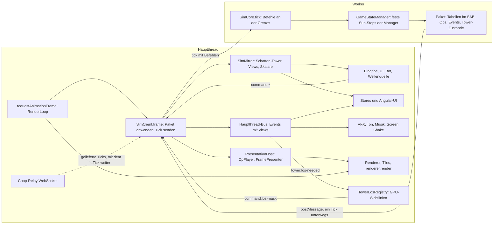
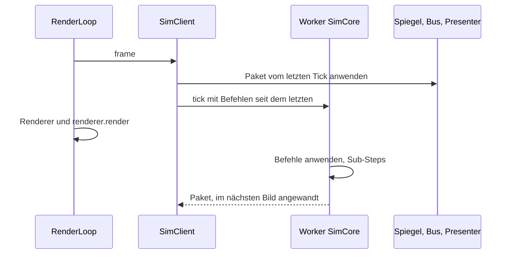

# Simulation im Worker (Umbau, Branch `simu-worker`)

Stand 2026-09-29 abends: Die Simulation läuft im Worker, alle Phasen sind umgesetzt. Specs, Lint und Build sind grün,
die E2E-Suite läuft auf dem Worker-Stand, auch auf echten Tiles. Offene Prüfungen (Handtest, Bot-Lauf, Desktop-App,
Header der Webseite) stehen in TODO E71. Die Simulation läuft in einem Web Worker, der Hauptthread hält nur Bild, Ton,
UI, Eingabe, Tiles und die GPU-Sichtlinien. Grundlage: [WORKER_PLAN.md](WORKER_PLAN.md) (Stufe 1: echte Simulation im
Worker bitgleich).

## Überblick





Jedes Bild beginnt mit `requestAnimationFrame` in der `RenderLoop`; `GameLoopFacadeService` ruft darin
`SimClient.frame`. Der wendet das Paket an, das seit dem letzten Bild aus dem Worker kam, und schickt den nächsten
Tick mit den Befehlen seit dem letzten, solange kein Tick unterwegs ist. Der Worker rechnet die Sub-Steps, während
der Hauptthread mit dem zuletzt angewandten Stand rendert. Beim Anwenden geht der Zustand in den Spiegel, die Ops an
den Presenter, die Events auf den Hauptthread-Bus und die Tabellen an die Renderer; UI, Ton, Bot und Wellenquelle
lesen nur Spiegel und Bus und antworten mit `command:*`. Nebenwege: Die Welt geht beim Laden einmal als `SimWorld` in
den Worker, im Coop reicht der Hauptthread die Ticks des Relays durch, das Replay ist ein Modus des Workers.

## Grundsätze

- **Ein Weg.** Der Hauptthread greift nie auf Sim-Objekte zu (kein `GameStateManager`, keine Manager, keine lebenden
  `Enemy`/`Projectile`). Er liest den Spiegel (`SimClient.mirror`), hört den Hauptthread-Bus (`SimClient.bus`, Events
  mit Views) und gibt Befehle (`command:*`). Die Simulation (`SimCore`) läuft im Worker; im selben Thread nur für
  Specs, über dieselbe Schnittstelle (`SimCoreApi`, `sim/protocol/messages.ts`).
- **Die Simulation kennt weder Engine noch Angular-UI.** Keine `ThreeTilesEngine`, keine Stores, keine Renderer.
  Darstellung geht als Op (`SimSink`, aufgezeichnet, `sim/protocol/ops.ts`), als Event oder als Tabelle im Paket.
- **Ein Paket je Bild** (`sim/protocol/packet.ts`): Tabellen (Gegner, Geschosse, Tower, Oozes, Wurmketten),
  Skalare, geänderte Tower-Zustände, Ops, Events. Der Hauptthread wendet es an: Tower-Zustände, Gegner-Tabelle,
  Ops, dann Events, dann die Tabellen an die Renderer.
- **Keine parallelen Systeme.** Alter Pfad fällt mit dem neuen.

## Datenfluss

```
Hauptthread                                   Worker
UI/Eingabe --command:*--> SimClient.bus -----> tick{commands} --> SimCore (GameStateManager ...)
Renderer/Ton <-- Presenter/OpPlayer <-- Paket <-- frame        <-- Paket (Tabellen, Ops, Events)
Stores/UI    <-- GameStateSync etc.  <-- SimClient.bus (Views)
LOS (GPU)    <-- tower:los-needed    --> command:los-mask --> SimCore
```

- Ein Tick ist unterwegs, dann erst der nächste (Gegendruck). Befehle zwischen zwei Ticks gehen mit dem nächsten.
- Befehle wirken an der Grenze vor dem ersten Sub-Step des Ticks (wie heute zwischen zwei Bildern).

## Verträge

| Datei | Inhalt |
|---|---|
| `sim/protocol/packet.ts` | Paket, Tabellen-Layout (Spalten `E_*`, `P_*`, `T_*`, `O_*`, `W_*`), Skalare, `TowerStateDto` |
| `sim/protocol/ops.ts` | Op = `[Pfad, ...Argumente]`, Rekorder; Argumente nur plain, Vektor als `{x,y,z}` |
| `sim/protocol/events.ts` | Events über die Grenze: Entities als Referenzen (`$e`, `$t`, `$p`, `$w`) mit den Zahlen des Moments |
| `sim/protocol/messages.ts` | `SimCoreApi` (configure, loadWorld, tick, rpc), `SimWorld`, Worker-Nachrichten |
| `sim/client/views.ts` | `EnemyView`, `ProjectileView`, `WormGroupView` mit den Feldpfaden der Entities |
| `sim/client/view-events.ts` | `ViewEvent = ToView<GameEvent>`, `MainEventBus` |

Tower auf dem Hauptthread sind **Schatten-Tower**: echte `Tower`-Objekte aus `TowerStateDto`, nie simuliert, ohne
den Id-Zähler anzufassen. `Tower.aim` wird je Bild aus der Tower-Tabelle gesetzt (der Tower-Renderer liest es).

## Entscheidungen

- **Sichtlinien:** Die Simulation wartet immer auf eine Maske (heute die Rolle des Coop-Gasts). Sie meldet
  `tower:los-needed`; der Hauptthread rendert auf der GPU und schickt `command:los-mask` (Einzelspieler und Coop-Host;
  Coop-Gäste rendern nicht). Die Maske steht im Befehlslog, das Replay braucht keine GPU. Folge: ein Tower bekommt
  seine Sicht ein bis zwei Bilder nach dem Bau.
- **Welt:** Der Hauptthread baut die Welt wie heute (Korridor, Tiles), friert sie ein und schickt `SimWorld`
  (Routen, Zellhöhen, Ursprung, HQ, Spawns, Boden unter den Spawns). Die Simulation baut ihr Raster daraus ohne Tiles;
  ihr Weltschlüssel muss dem des Hauptthreads gleichen. Der Hauptthread behält sein Raster für Sichtlinien, Anzeige
  und Boden der Renderer.
- **Wellenquelle, Bot:** bleiben auf dem Hauptthread und lesen den Spiegel. Die Wellenquelle zieht ihren Zufall aus
  einem eigenen `GameRng` mit dem Lauf-Seed (Strom `director`, dieselbe Folge wie bisher), der Bot ebenso (`bot`).
  Die Regeln der Wellenquelle gehen per `configure({waveSource})` in den Worker. Der Bot entscheidet je Bild statt je
  Sub-Step; seine Befehle wirken am nächsten Tick.
- **Stand, den die Wellenquelle liest:** Was sie bei `wave:completed` festhält (`StateSnapshotService`, etwa die
  Spielzeit) und was sie beim Planen der nächsten Welle liest, kommt aus dem Spiegel, also vom Ende des Pakets, mit
  dem das Event ankommt, nicht vom Sub-Step, in dem die Welle endete. Laufen mehrere Sub-Steps je Bild (hohes Tempo),
  kann dazwischen schon mehr geschehen sein. Bewusst so gelassen.
- **Auswahl eines Towers** ist UI-Zustand des Hauptthreads, nicht mehr der Simulation.
- **Coop:** Die Relay-Verbindung bleibt im Hauptthread; der Worker bekommt einen `LockstepLink`, der die gelieferten
  Ticks je Tick-Nachricht erhält und Befehle, Hashes, Glätte zurückschickt.
- **Replay:** läuft im Worker (RPC `replayEnter/Step/Seek/Exit`), Bilder kommen als normale Pakete.
- **Entwicklerwerkzeuge**, die heute Sim-Objekte ändern (Gegner anhalten, Tempo, Bewegung aus), werden `debug:*`-Befehle.

## Aufteilung

| Bereich | Wer | Dateien |
|---|---|---|
| Simulation frei von Engine und UI, `SimCore`, Worker-Einstieg | Agent `sim` | `managers/**`, `entities/**`, `game-components/**`, `services/combat/**`, Sim-Teil von `global-route-grid`, `simulator/**`, `sim/core/**`, `sim/worker/**` |
| Darstellung auf dem Hauptthread: OpPlayer, Presenter der Tabellen, Status-Looks, Gegner-/Ooze-/Wurm-Ton, Dienste (VFX, Audio, GameSounds, ScreenShake, Musik, Blutmond, HQ-Feuer) | Agent `pres` | `presentation/**` (neu), `game-engine/**` (Darstellung), `three-engine/**` (Anpassungen) |
| Spiegel und alle Leser auf dem Hauptthread | Agent `mirror` | `sim/client/mirror/**`, `components/**`, `services/**` (außer combat, LOS, Welt-Übergabe), `run-log/**`, `director/**`, `bots/**`, `store/**`, `tower-defense.component.*` |
| `SimClient`, Transporte, Event-Import, LOS-Dienst, Welt-Übergabe, Game-Loop, Coop, Replay, Integration | Lead | `sim/client/sim-client*.ts`, `sim/client/transport/**`, `services/tower-los-registry.ts`, LOS-Teil von `tower-placement`, `services/facade/*` (Verdrahtung), `services/coop.service.ts`, `services/replay.service.ts` |

## Phasen

1. Verträge (erledigt), dann parallel: `sim`, `pres`, `mirror`, Lead (Client, Transporte, LOS, Welt).
2. Zusammenführen, grün machen: Build, Specs, Spiel im Browser (E2E), Einzelspieler.
3. Worker-Transport scharf, Coop, Replay, Bots.
4. Messen gegen E57 (5000 Gegner, Tempo 4), E2E, Doku (ARCHITECTURE, EVENT_SYSTEM, WORKER_PLAN).

## Transport

- **Tabellen** (Gegner, Geschosse, Tower, Oozes, Würmer) im `SharedArrayBuffer` (`sim/protocol/table-store.ts`,
  `wire.ts`): der Worker schreibt, der Hauptthread liest ohne Kopie. Ein Tick ist unterwegs, also braucht der Speicher
  keine Sperre. Wächst eine Tabelle, geht der neue Puffer einmal mit. Ohne `crossOriginIsolated` dieselbe Form mit
  Kopien je Bild.
- **Variables** (Befehle, Events, Ops, Tower-Zustände, RPC) per `postMessage`; es ist zugleich das Wecksignal.
  `Atomics.wait`/`notify` bräuchten wir nur für ein reines Shared-Memory-Signal; der Worker dürfte dann blockierend
  warten, der Hauptthread liest einmal je Bild (Firefox hat kein `Atomics.waitAsync`).
- **Header** für die Isolation: Web `public/.htaccess` (COOP same-origin, COEP credentialless), Dev-Server in
  `angular.json`, Desktop-App im `app://`-Handler. Nach dem nächsten Deploy mit `curl -I` prüfen.

## Kennzahlen

Zwei Zahlen statt einer: die **Bildzeit** des Hauptthreads (FPS) und die **Tick-Zeit** der Simulation im Worker
(`SimScalars.tickMs`, zerlegt per RPC `tickProfile`); dazu kostet das Anwenden eines Pakets den Hauptthread
`SimClient.applyTimes`.

Messung 2026-09-29 abends (`e2e/perf/sim-load.ts`, Produktions-Build, DevWorld, 40 Tower, 4800 Gegner, Tempo 4, ein
Windows-Rechner, beide Builds in derselben Sitzung):

| | ohne Worker (`next`) | mit Worker |
|---|---|---|
| Chromium ohne Bildratenbremse, FPS / langsamste 5 % | 356 / 185 | 366 / 168 |
| Firefox sichtbar (144-Hz-Monitor), FPS / langsamste 5 % | 35 / 24 | 70 / 36 |
| Worker ausgelastet (Chromium / Firefox) | – | 30 / 28 % |

In Chromium kostet die Simulation in dieser Szene wenig, beide Builds liegen gleich. In Firefox doppelte Bildrate.

Korrektur: Die erste Messung am Nachmittag (Firefox 127 / 72, Chromium 296 / 200) lief mit einem Stand, auf dem die
Gegnergruppen der Seitenleiste fehlten (Review-Befund, `wave:groups` ohne Hörer). Deren 3D-Vorschauen rendern mit
30 FPS über einen zweiten WebGL-Renderer und kopieren jedes Bild per `drawImage` ins 2D-Canvas
(`model-preview.service.ts`); in Firefox kostet das rund 6 ms je Bild (124 statt 69 FPS in derselben Szene, per
Bisect auf `fe2d2c62`). `next` zahlt diese Kosten auch, der Vergleich oben ist fair.

## Mehr Gegner (gemessen 2026-09-29)

Ziel: mehr Gegner gleichzeitig bei gleicher Bildrate, Tempo 4 gehalten. Messkurve mit `e2e/perf/sim-load.ts --steps
3000,5000,8000,12000,16000 --speeds 4,1` (Produktions-Build, DevWorld, 40 Tower, sichtbare Fenster auf einem
144-Hz-Monitor, Werte summiert über alle Pakete). Die Zeilen mit Tempo 1 direkt nach dem Auffüllen sind unbrauchbar:
das Debug-Spawnen rechnet im Messfenster mit (Routenprofil je Pfadstück), deshalb nur Tempo 4:

| Gegner (lebend) | Chromium FPS / p05 | Tempo | Worker | Firefox FPS / p05 | Tempo | Worker |
|---|---|---|---|---|---|---|
| ~2800 | 144 / 143 | 4,0 | 19 % | 86 / 36 | 4,0 | 20 % |
| ~4500 | 144 / 143 | 4,0 | 20 % | 73 / 36 | 4,0 | 28 % |
| ~7300 | 144 / 143 | 4,0 | 36 % | 69 / 36 | 3,8 | 43 % |
| ~11000 | 143 / 143 | 4,0 | 63 % | 41 / 18 | 2,9 | 47 % |
| ~14500 | 132 / 72 | 3,8 | 77 % | 33 / 16 | 2,0 | 50 % |

- **Chromium** hält 144 FPS und Tempo 4 bis rund 11000 Gegner; bei rund 14500 wird der Worker knapp (3,4 ms je
  Spielzug, 77 % ausgelastet) und das Tempo sinkt auf 3,8.
- **Firefox** hängt schon früh am Hauptthread, der Worker ist nie mehr als halb ausgelastet. Das Anwenden eines Pakets
  kostet 2,5 ms bei 2800 und 11,7 ms bei 15000 Gegnern, rund 60 % davon `present` (Tabellen an die Renderer), rund
  35 % `state` (Spiegel). Dazu die Vorschau-Kopie der Seitenleiste (siehe Kennzahlen). Weil ein Tick erst mit dem
  nächsten Bild losgeht, bremst das langsame Bild auch das Spieltempo.
- **GPU je Gegner** (Chromium ohne Bremse, Tempo 1, Gegner ein- und ausgeblendet): 0,3 ms bei 3000, 1,7 ms bei 8000,
  4,7 ms bei 16000 Gegnern je Bild, also rund 0,3 µs je Gegner; bei 16000 mehr als die Hälfte des Bildes.

Hebel nach den Messwerten:

1. **Hauptthread verschlanken** (vor allem Firefox): Spiegel und Presenter laufen je einmal über alle Gegner mit eigener
   Map (`sim-mirror.ts` applyEnemyTable, `frame-presenter.ts`); eine Schleife, Views nur bei Bedarf, Instanzpuffer
   direkt aus der Tabelle.
2. **Vorschau der Seitenleiste ohne Kopie je Bild** (Firefox rund 6 ms je Bild, auch ohne Worker).
3. **Tick vom Bild lösen**: den nächsten Tick losschicken, sobald das Paket da ist, statt beim nächsten Bild (braucht
   zwei Tabellen-Puffer im SAB, weil der Hauptthread noch liest). Heute wartet der Worker bis zur Hälfte der Zeit.
4. **GPU je Gegner**: Culling pro Instanz (die Gegner-Instanzen haben `frustumCulled = false`), einfacheres Modell in
   der Entfernung, Lebensbalken nur nahe der Kamera.
5. **Worker schneller** (Chromium ab rund 14000): Gegnerfelder als typisierte Arrays im SAB, danach mehrere Worker
   phasenweise im Sub-Step. Erst wenn 1 bis 4 nicht reichen.
